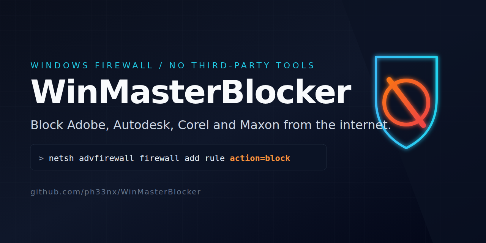

# WinMasterBlocker

<p align="center">
  
</p>

<p align="center">
  <a href="LICENSE"></a>
  <a href="https://github.com/ph33nx/WinMasterBlocker/stargazers"></a>
  <a href="https://github.com/ph33nx/WinMasterBlocker/actions/workflows/ci.yml"></a>
  <a href="https://github.com/ph33nx/WinMasterBlocker/commits/main"></a>
  
  
</p>

> Windows 10 support tracks Microsoft's consumer ESU window and will be reduced to best-effort after October 13, 2026.

A small Windows batch script that uses the built-in Windows Firewall to block Adobe, Autodesk, Corel, Maxon and Red Giant applications from reaching the internet. No drivers, no kernel hooks, no third-party services, no subscription. The script reads a vendor list, walks every install directory it knows about, and adds inbound and outbound `block` rules per executable through `netsh advfirewall`.

If you have ever watched `acrocef.exe`, `RdrCEF.exe` or the Adobe Genuine Service phone home minutes after a fresh install, this is for you.

## What it blocks

| Vendor | Why you might want this | Common process names blocked |
| --- | --- | --- |
| **Adobe** | License-server polling, telemetry, Creative Cloud sync, Acrobat CEF children | `acrocef.exe`, `RdrCEF.exe`, `Acrobat.exe`, `AcroRd32.exe`, `AdobeNotificationClient.exe`, `AdobeIPCBroker.exe`, `Creative Cloud.exe` |
| **Autodesk** | Single-sign-on heartbeats, AutoCAD telemetry, license-manager polling | every `*.exe` under `Autodesk\` and `Autodesk Shared\` |
| **Corel** | Activation server checks, update prompts | every `*.exe` under `Corel\` |
| **Maxon** | Cinema 4D license polling, render-node check-ins | every `*.exe` under `Maxon\` |
| **Red Giant** | Trapcode license heartbeat, Universe activation | every `*.exe` under `Red Giant\` |

Coverage is two-layered. First a recursive walk of every known install path (`%ProgramFiles%\Adobe`, `%LOCALAPPDATA%\Adobe`, `%APPDATA%\Adobe` and the rest). Then a vendor-specific known-process sweep that scans every other logical drive's `\Adobe\` root and `%USERPROFILE%\Adobe\` for the specific binaries that have historically slipped past — covers custom installs to `D:\Adobe\` or any other non-default drive the main walk cannot reach.

## Quickstart

1. Download `WinMasterBlocker.bat` from this repo.
2. Right-click it, **Run as administrator**. If you double-click, the script re-launches itself with elevation through PowerShell.
3. Pick a vendor from the menu. Pick `98` after a vendor update to re-scan and add any new executables. Pick `99` to remove every rule the script added.

A transcript log lands at `%TEMP%\WinMasterBlocker-YYYYMMDDhhmmss.log`. Every check, skip and rule add is recorded there. Most "it did not work" reports are answered by reading the last 50 lines of that file.

## How it compares

| | **WinMasterBlocker** | SimpleWall | NetLimiter | GlassWire |
| --- | --- | --- | --- | --- |
| License | MIT | LGPL | Commercial | Commercial |
| Price | Free | Free | $30 / 2 yr | $39 / yr |
| Third-party driver | None | WFP filter driver | WFP filter driver | WFP filter driver |
| Per-application rules | Yes (per `.exe`) | Yes | Yes | Yes |
| GUI | None (menu only) | Yes | Yes | Yes |
| Profile-aware (Domain / Private / Public) | No (rule applies to all) | Yes | Yes | Yes |
| Scriptable / unattended | Yes (env vars) | Limited | Yes | No |
| Auditable in plain text | Yes (17 KB single file) | No | No | No |
| Survives reboot | Yes (Windows Firewall persists) | Yes | Yes | Yes |
| Survives uninstall of the tool | Yes (rules are native) | No | No | No |

WinMasterBlocker is for the case where you want firewall rules and only firewall rules: visible in `wf.msc`, exportable through `netsh advfirewall export`, removable through Group Policy, the same shape an enterprise admin would write by hand. If you want a packet log, an outbound prompt UI or per-NIC bandwidth shaping, use one of the commercial tools above.

## FAQ

### Is this safe to run?

Yes. The script only invokes `net session`, `netsh advfirewall firewall add rule`, `netsh advfirewall firewall delete rule`, and a single PowerShell call to enumerate existing rules. No registry edits, no service installs, no driver loads, no scheduled tasks. Every action is written to the transcript log before it is executed, and every change is reversible from the Windows Firewall UI (`wf.msc`) or by running this script with menu option `99`. The full source is one batch file, around 450 lines, that you can read top to bottom in five minutes. There is no telemetry, no auto-update, and no network call from the script itself.

### Will Adobe still activate after I run this?

Yes, with one caveat. Adobe activation reaches the network through `Adobe Desktop Service.exe` and `node.exe` under `Creative Cloud`, both of which the recursive walk will block. Run the script first, complete activation while temporarily disabling the relevant rules, then re-enable them. The simpler path for most users: install and activate first, then run WinMasterBlocker. Subsequent re-activations after license changes will need the same temporary unblock.

### Why is `acrocef.exe` still connecting after I ran the script?

Three causes account for almost every report. First, Acrobat was installed or updated after the last run; re-run the script, or pick option `98` (Update Adobe). Second, Adobe placed a new CEF child under `%LOCALAPPDATA%\Adobe\` that the previous version of WinMasterBlocker did not walk; this version walks both `%LOCALAPPDATA%` and `%APPDATA%`. Third, the previous version made a slow PowerShell duplicate-check call per executable and large Adobe installs took five minutes or more to finish; users killed the run before AcroCEF was reached. The 2.0 release replaces that with a single up-front rule cache, so the Adobe walk completes in seconds.

### How do I undo a block?

Run `WinMasterBlocker.bat` and choose option `99` from the menu. You then pick whether to delete inbound rules, outbound rules, or both. The script only removes rules whose display name ends in `-block`, which is the suffix it appends to every rule it creates, so it will not touch firewall rules added by other tools or by Windows itself. You can also remove rules from the GUI (`wf.msc`, sort by Name, find rules ending in `-block`) or with `netsh advfirewall firewall delete rule name=all dir=out` if you want a fresh start across every outbound rule on the machine.

### Does the block survive Adobe updates?

The rules survive. New executables introduced by an update do not get blocked automatically, because the rules target specific paths. After an Adobe Acrobat or Creative Cloud update, run the script again and pick option `98` (Update Adobe). The cache-aware duplicate detection means existing rules are skipped instantly; only new executables get new rules. The transcript log lists every rule added on that pass, which makes it easy to confirm that the new CEF children from the update are now blocked.

### Will it block Windows Update or Microsoft Defender?

No. The vendor list contains Adobe, Corel, Autodesk, Maxon and Red Giant only. The recursive walks happen under `%ProgramFiles%\<vendor>\`, `%ProgramFiles(x86)%\<vendor>\`, `%CommonProgramFiles%\<vendor>\`, `%ProgramData%\<vendor>\`, `%LOCALAPPDATA%\<vendor>\` and `%APPDATA%\<vendor>\`. Nothing under `%WINDIR%`, `%SystemRoot%`, `%ProgramFiles%\WindowsApps` or `%ProgramFiles%\Windows Defender` is touched. If a vendor binary is somehow installed inside one of those locations, the script will walk it; that is rare and would be a packaging mistake worth a separate report.

## Troubleshooting

The transcript log at `%TEMP%\WinMasterBlocker-YYYYMMDDhhmmss.log` records every action. If the script "did nothing", open the latest log: it will show either `path missing` for every Adobe path (you do not have Adobe installed where the script expected, or the elevation switched user contexts and lost `%LOCALAPPDATA%`), or `skip "<rulename>"` for every executable (the rules already exist from a previous run), or a list of `add` lines (it worked, the rules are now in `wf.msc`).

Set `WHATIF=1` in the environment before running to see what the script would do without making any firewall changes. Useful as a dry run after editing the script or paths.

## For IT pros and unattended use

Four environment variables drive an unattended run from a deployment script, MDM payload or scheduled task:

```cmd
set WHATIF=1
set WMB_VENDOR=Adobe
set WMB_ACTION=block
set WMB_QUIET=1
WinMasterBlocker.bat
```

`WHATIF=1` logs every netsh call without executing it (dry run). `WMB_ACTION=delete` removes every rule added by the script. `WMB_QUIET=1` suppresses per-rule console output (the transcript log is still written). All four survive the UAC re-launch when the script elevates itself on double-click.

To export the resulting rules into a `.wfw` file you can re-import on other machines, or push through Group Policy:

```cmd
netsh advfirewall export "C:\share\winmasterblocker-rules.wfw"
```

The exported file is a binary blob that `netsh advfirewall import` understands on any Windows 10 or 11 host.

## Contributing

Contributions for new vendors and new install paths are welcome.

```bash
git clone https://github.com/ph33nx/WinMasterBlocker
cd WinMasterBlocker
# Install lefthook (https://lefthook.dev), then:
lefthook install
```

The pre-commit hook runs `tools/lint-bat.sh`, `tools/format-check.sh` and `tools/audit-coverage.sh` against `WinMasterBlocker.bat`. The audit script asserts that the Adobe known-CEF list still contains `acrocef.exe`, `RdrCEF.exe` and the other binaries that earlier issues identified, so the regression that originally inspired #6 cannot silently come back.

A new vendor:

```batch
set "vendors[5]=NewVendor"
set "paths[5]=%ProgramFiles%\NewVendor;%ProgramFiles(x86)%\NewVendor;%LOCALAPPDATA%\NewVendor"
```

A new known-bad executable for an existing vendor: append it to the relevant `for %%E in (...)` list in the `:adobe_sweep_root` helper (or the equivalent for other vendors as they grow) and add it to `REQUIRED_ADOBE_EXES` in `tools/audit-coverage.sh` so future commits cannot drop it.

## Citation

A `CITATION.cff` is included; GitHub renders a "Cite this repository" button on the right sidebar. If you reference this tool in articles or research, please cite the repository directly rather than copy-pasting the script.

## License

MIT. See [`LICENSE`](LICENSE). SPDX identifier `MIT` is set in the script header.

## Author

[@ph33nx](https://github.com/ph33nx)
